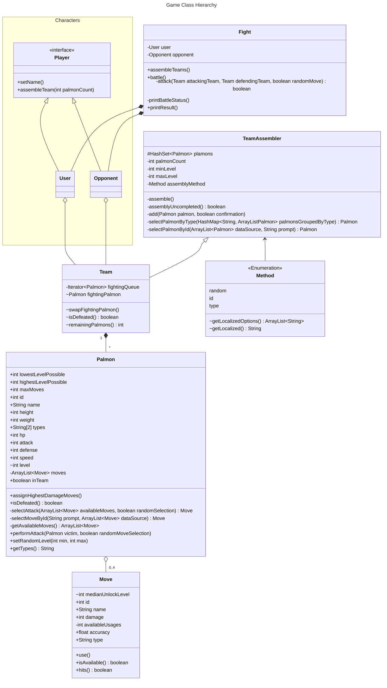

# The Palmon Game

A console-based Pokémon adventure created in Java as a university task.

1. **Diverse**: Assemble your team from a variety of characters.
2. **Interactive**: Choose your strongest attacking moves.
3. **Multilingual**: English or German - you decide.

---

---

## Technical Implementation

### Entities

---

### Resources

4 CSV files are loaded in a seperate thread after the game starts. Their processed base data can be accessed using the DB class.

1. **palmon.csv**: The information of more than 1000 Palmons.
2. **moves.csv**: All the attacks a Palmon can learn.
3. **palmon_move.csv**: n:m connection between a Palmon and its moves + their learned level.
4. **effectivity.csv**: The damage multiplier between different types.

---

### Utilities

- **CSV Processing**: Package consisting of a CSVLoader that schedules a CSVReader for each resource file. Based on an abstract class, there are various line processors passed as a dependency to the CSVReaders.
- **Data Normalization**: Converts CSV data and user input to the correct data format.
- **Execution Pause**: Stops the execution thread on demand to enhance the console output speed for the user.
- **Localization**: Configuration and accessor-methods to enable multi-language print statements.
- **Map [Heap](https://en.wikipedia.org/wiki/Heap_(data_structure))**: Custom data structure to assign the highest-damage moves to a Palmon.
- **Table Output**: Prints Palmons or Moves in a table format based on System.out.printf().
- **User Input**: Various overloaded methods to get user input in the right format and handle errors.

---

## Personal Key Learnings

### Reusable Utilities
- console input with reliable error handling
- table printing with flexible configuration
- data loading using dependy injection
### Effective Data Processing
- custom max heap data structure
- handling of data inconsistency
- asynchronous threading
 ### Language-specific Features
- enums and records
- resource bundles
- abstract class
---
## Possible expansions

- .exe distribution using [javapackager](https://docs.oracle.com/javase/10/tools/javapackager.htm)
- prioritizing code efficiency over readability
- fight history documentation with CSV file
